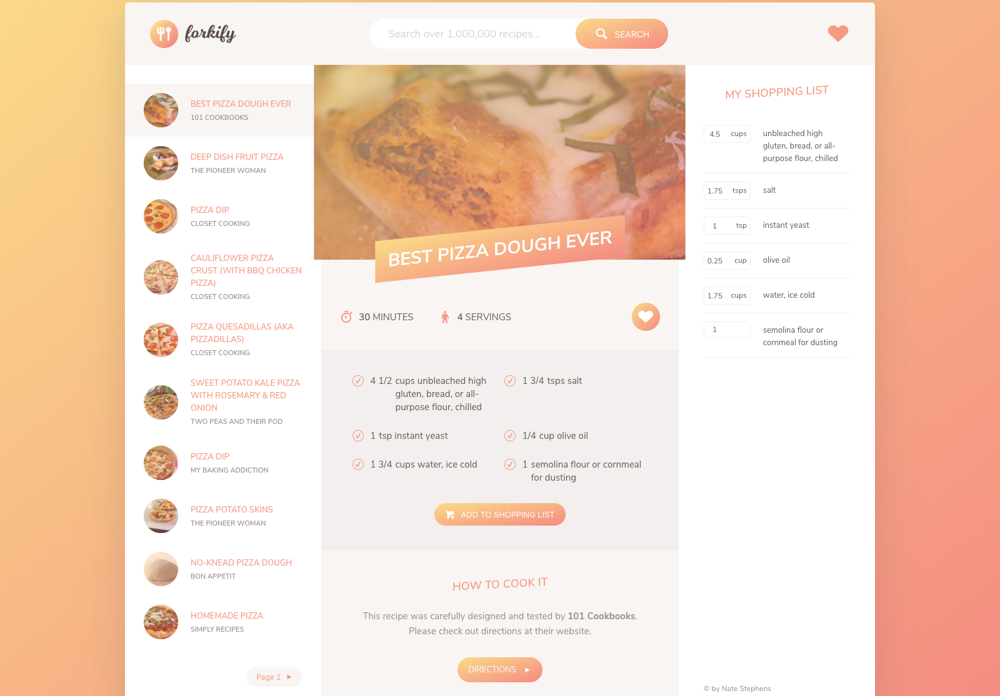

# Forkify

## Find recipes, create shopping list, save your favorites

Uses a recipe API for search queries.  Shopping lists are created from recipe ingredient list and can be modified.  Favorite recipes can be saved for future quick reference (saved in local storage).  Pagination is used to help limit returned results.

No framework, just vanilla JS using an MVC pattern.

Unfortunately requires use of a CORS proxy to connect with the recipe API. It
will sometimes act funky and send an error. Try again later...🤷🏻‍

### View working demo [here](https://nds-forkify.netlify.com)

 

